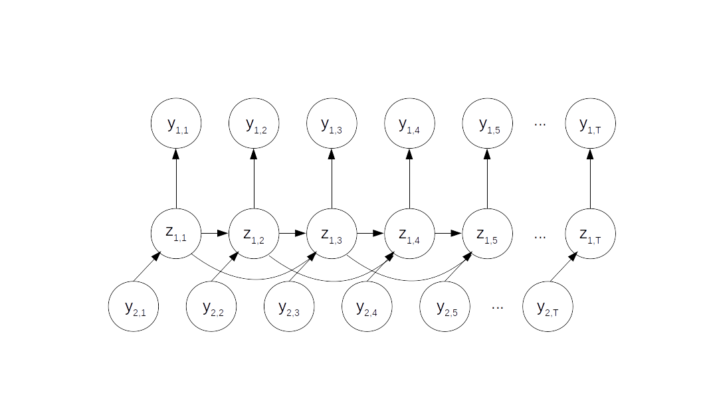

# Finding linear correlations amongst the SDG targets using model-based machine learning 

We us a temporal model to infer missing observations and compute the covariance in the residuals to find **linear** correlations amongst the SDG targets. We combine a linear dynamical system (LDS) with inputs with an autoregressive model of order 2 (AR2).

